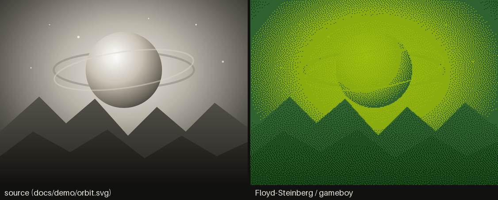
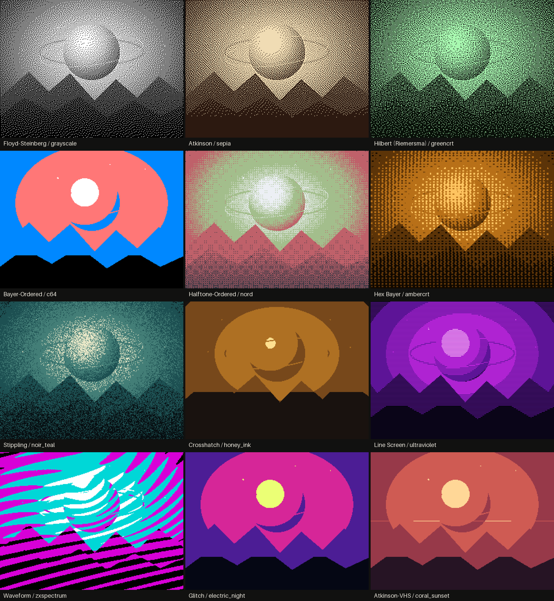
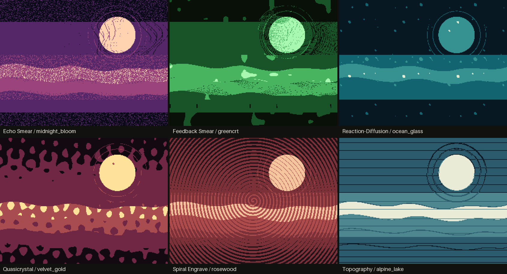
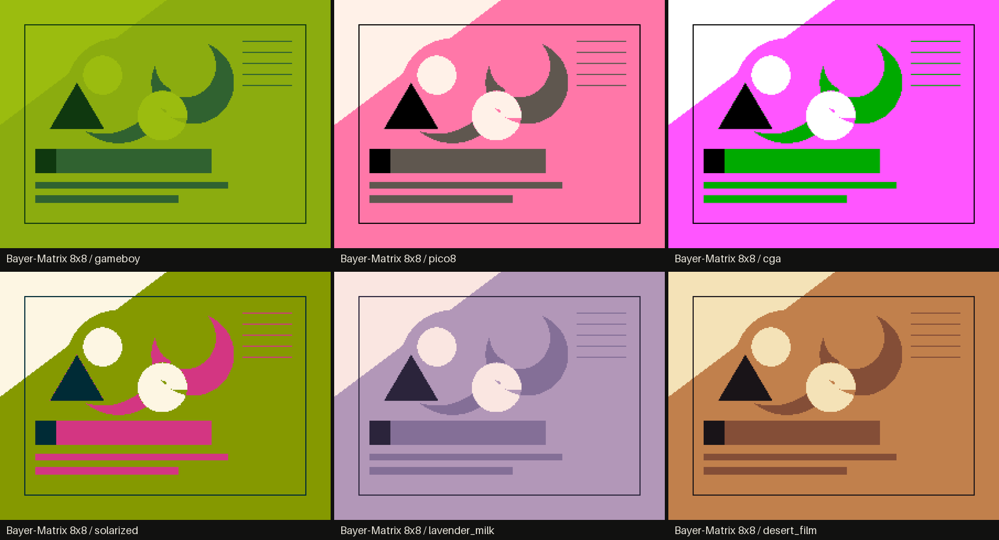

# ditherzam



ditherzam is a desktop image, animation, and video dithering studio built with
Python, PySide6, NumPy, Pillow, and Numba. It combines 77 dithering styles, a
palette-driven color engine, non-destructive tonal controls, composable effects,
live previews, presets, batch processing, vector export, animation, and
frame-by-frame video processing in one application.

The renderer is deterministic: a render is defined by its source, settings,
palette, effects, and seed. Interactive previews may be resolution-capped for
responsiveness, while image and media exports always use the full source data.

## Download for Windows

Windows x64 users can download either build from the
[ditherzam 0.1.0 release](https://github.com/arshazam1387/ditherzam/releases/tag/v0.1.0):

- **Installer:** `ditherzam-0.1.0-windows-x64-setup.exe` installs per user,
  adds a Start Menu shortcut, offers an optional Desktop shortcut, and includes
  an uninstaller. Administrator access is not required.
- **Portable:** `ditherzam-0.1.0-windows-x64-portable.zip` can be extracted
  anywhere; launch `ditherzam.exe` and keep its `_internal` folder beside it.

Both downloads bundle FFmpeg and FFprobe and are licensed GPL-3.0-only. Smart
Mask model weights are deliberately excluded, so Smart Mask remains disabled.
The binaries are unsigned and may trigger Windows SmartScreen; verify the
published SHA-256 checksums and do not disable or weaken SmartScreen.



## Highlights

- 77 styles across error diffusion, ordered, patterned, glitch, and generative
  families
- 31 built-in palettes plus image-extracted and user-edited palettes
- Binary and multilevel dithering with palette tone ramps
- Per-style controls alongside scale, depth, mix, rotation, offset, jitter, and
  deterministic seed controls
- Brightness, contrast, midtone, highlight, saturation, and inversion stages
- Epsilon glow, chromatic aberration, JPEG glitch, blur, and sharpen effects
- PNG, JPEG, WebP, TIFF, BMP, and SVG output
- Presets, batch processing, animated temporal patterns, and FFmpeg video export
- Optional offline subject/background masking through a locally staged ONNX model
- Bounded caches, latest-wins background rendering, and Numba-compiled hot paths



## Requirements for source installs

- Python 3.12
- Windows, macOS, or Linux with Qt support
- FFmpeg and FFprobe on `PATH` for video workflows
- A local ONNX Runtime installation and approved model asset only if Smart Mask
  is required; the main image editor does not need a model

## Install and run

```bash
git clone https://github.com/arshazam1387/ditherzam.git
cd ditherzam
python -m venv .venv
```

Activate the environment, then install the project:

```bash
python -m pip install --upgrade pip
python -m pip install -e .
ditherzam
```

On Windows PowerShell, activate with:

```powershell
.\.venv\Scripts\Activate.ps1
```

You can also launch without the console script:

```bash
python -m ditherzam.app
```

Open an image, choose a style and palette, adjust the controls, then export from
the File menu. Preview resolution preferences affect only the editor display;
exports remain exact and full-resolution.

## How rendering works

The core renderer accepts a grayscale `float32` source and immutable render
settings. Its fixed stage order is:

```text
source -> tonal adjustments -> dither -> color mapping -> saturation
       -> invert -> effect stack -> output
```

The dither registry keeps style metadata separate from algorithm functions.
Styles that produce native multilevel output feed that directly into the color
engine; binary styles are promoted to additional tone levels without changing
their two-level behavior. Palette mapping can follow luminance, cycle, mirror,
ping-pong, random, or depth-ramp strategies.

The UI never mutates a render already in flight. It snapshots the request,
renders it on a worker thread, coalesces rapid control changes into the newest
pending request, and discards obsolete results. Staged results are stored in a
memory-bounded LRU cache. The complete design is documented in
[docs/ARCHITECTURE.md](docs/ARCHITECTURE.md).

## Performance

ditherzam uses Numba for computationally expensive kernels and NumPy for vector
operations. Startup warm-up compiles common kernels in the background. Preview
images are capped to a configurable logical resolution, obsolete renders can
stop between pipeline stages, and exports use isolated full-resolution render
contexts so preview state cannot reduce output quality.

Measured benchmark notes and reproducible scripts live in [benchmarks](benchmarks/).
Results depend on image size, style, palette mode, CPU, and thread budget.

## Gallery sources

The gallery is reproducible from the original SVG artwork in [docs/demo](docs/demo/):

```bash
python tools/render_gallery.py
```

The script rasterizes the SVG files with Qt, processes them through the actual
ditherzam render pipeline, and rebuilds the contact sheets in `docs/images`.



## Development

Install the development dependency and run the suite with JIT disabled for a
fast, deterministic test pass:

```bash
python -m pip install -e ".[dev]"
NUMBA_DISABLE_JIT=1 python -m pytest -p no:cacheprovider -q
```

PowerShell equivalent:

```powershell
$env:NUMBA_DISABLE_JIT = "1"
python -m pytest -p no:cacheprovider -q
```

Kernel changes should also be tested with JIT enabled. See
[docs/ARCHITECTURE.md](docs/ARCHITECTURE.md) for module boundaries and invariants.
Windows release reproduction is documented in [BUILDING.md](BUILDING.md).

## Smart Mask status

Smart Mask is deliberately fail-closed. No model weights are included, downloaded,
or silently fetched. If no locally staged and validated asset is available, the
feature remains disabled while the rest of the application operates normally.
See [assets/models/smart_mask/README.md](assets/models/smart_mask/README.md) and
[THIRD_PARTY_NOTICES.md](THIRD_PARTY_NOTICES.md) before distributing a model.

## License

ditherzam is free software licensed under the
[GNU General Public License v3.0 only](LICENSE). You may use, study, modify, and
redistribute it under the terms of that license. Distributed modified versions
must remain under GPL-3.0 and include their corresponding source code.
